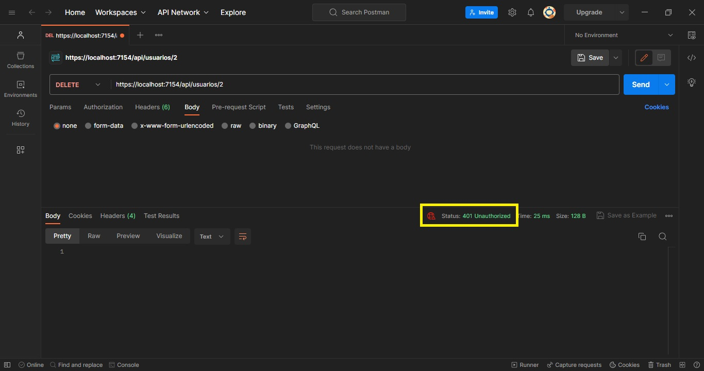
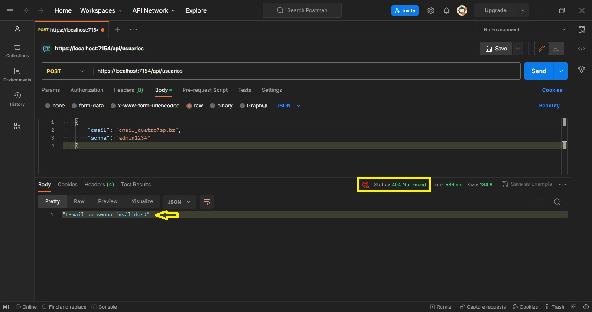
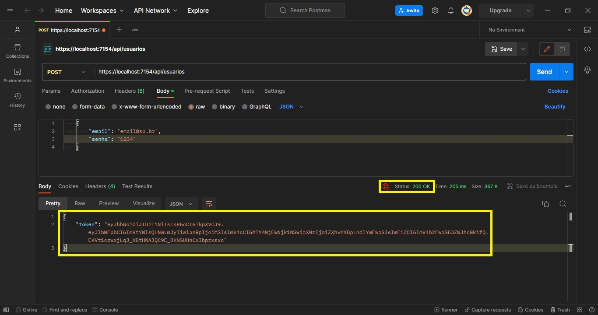
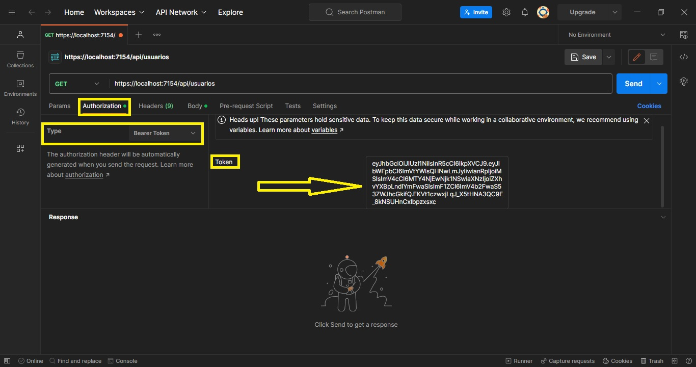
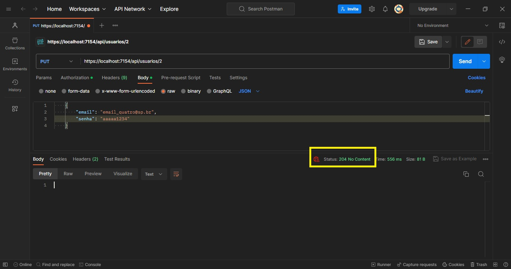
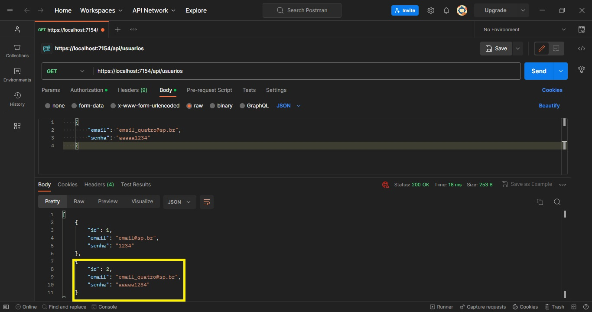
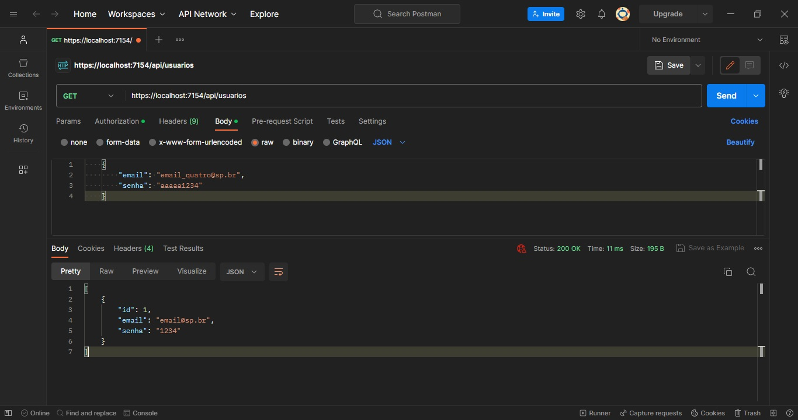

# Desenvolvimento de APIs

<p>Curso Programador Back-end | Entrega da atividade 06 - Senai</p>

* Criar método de login e CORS. 

>> Por meio deste projeto é possível realizar um CRUD completo tanto em projetos quanto em usuarios. <br/>
>> Para realizar Atualizações e Exclusões de registros da tabela usuários é necessário estar autenticado.


## Código para criação do BD, Tabela e Inserts (SQL Server)

```sql

CREATE DATABASE ExoApi
GO

USE ExoApi
GO

CREATE TABLE Projetos (
    Id INT PRIMARY KEY IDENTITY,
    NomeDoProjeto VARCHAR(150) NOT NULL,
    Area VARCHAR(150) NOT NULL,
    Status BIT
)
GO

INSERT INTO Projetos (NomeDoProjeto, Area, Status) 
VALUES ('Projeto A - Obras BR', 'Construção Civil', 1)
GO

INSERT INTO Projetos (NomeDoProjeto, Area, Status) 
VALUES ('Projeto B - SENAI Fest', 'Eventos', 0)
GO

INSERT INTO Projetos (NomeDoProjeto, Area, Status) 
VALUES ('Projeto C - Hackathon Fest', 'Eventos', 1)
GO

-- UPDATE Projetos SET NomeDoProjeto = 'NomeDoProjeto A1' Where Id = 1;

 -- DELETE FROM Projetos WHERE Id = 1;

SELECT Id, NomeDoProjeto, Area, Status FROM Projetos
GO

CREATE TABLE Usuarios (
    Id INT PRIMARY KEY IDENTITY,
    Email VARCHAR(255) NOT NULL UNIQUE,
    Senha VARCHAR(120) NOT NULL
)
GO

INSERT INTO Usuarios VALUES ('email@sp.br', '1234')
GO

INSERT INTO Usuarios VALUES ('email_dois@sp.br', '1234')
GO

SELECT * FROM Usuarios
GO

```


## Resultado obtido

<!-- ### Testes sem estar autenticado -->
#### Relializando requisições que necessitam de autenticação SEM ESTAR autenticado

> Atualização de cadastro - PUT


> Exclusão de registro



> **Autenticação de usuário**

>> Usuário não localizado



>> Usuário localizado e autenticado -> Geração de Token



## Passos para realizar requisições nos métodos que necessitam de autorização
* Autenticar o usuário (relizado acima);
* No Postman, ir no menu **Authorization**, no **Type** escolher -> **Bearer Token** e inserir o token do usuário gerado. Feito isso, o usuário estará autenticado e poderá realizar requisições PUT e DELETE com sucesso por 30min.



#### Relializando requisições que necessitam de autenticação ESTANDO autenticado
> Atualização de cadastro - PUT



> Listando todos os registros com o **cadastro 2 atualizado**



> Exclusão de registro 


> Listando todos os registros após **EXCLUSÃO do cadastro 2**



